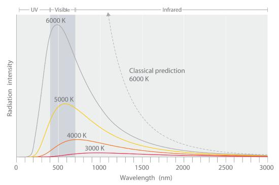

# Black Body Radiation

## Background

In the late 19th century, scientists were puzzled by the phenomenon of black body radiation. A black body is an object that absorbs all radiation that falls on it and does not reflect any back. When such an object is heated, it emits radiation in the form of light, and the intensity and frequency distribution of this radiation are what is known as black body radiation. The problem that physicists were grappling with was why the frequency distribution of this radiation did not match what classical physics predicted.

To understand this phenomenon, it is necessary to know that all tangible bodies in the universe emit energy in the form of electromagnetic radiation. The amount of energy emitted by a body depends on several factors, such as temperature or color of the body. As the temperature of a body increases, the average frequency, and thereby energy, of the electromagnetic waves it emits increases as well. Hence an electric stove burner or the filament of a space heater glows dull red or orange when heated, whereas the much hotter tungsten wire in an incandescent light bulb gives off a yellowish light.

## Overthrow of Classical Physics

Classical physics, which was the dominant paradigm at the time, assumed that electromagnetic radiation was continuous and could have any energy value. This would mean that a heated black body should emit a continuous spectrum of radiation with increasing intensity as the frequency increased. For example, classical physics predicted that as wavelength decreases, the intensity of the radiation an object emits should increase in a smooth curve without limit at all temperatures, as shown by the broken line for 6000K. As a result, classical physics could not account for the significant decrease in the intensity of radiation emitted at shorter wavelengths, primarily in the ultraviolet region of the spectrum. In fact, it predicted that an infinite amount of ultraviolet radiation would be emitted. Of course, experiments showed that this was not the case. Instead, the frequency distribution of black body radiation peaked at a certain frequency, and then decreased rapidly with increasing frequency.

This discrepancy between theory and experiment became known as the "ultraviolet catastrophe," and it led to the development of quantum mechanics. The solution to the problem lay in the idea of quantization, which suggested that energy could only be absorbed or emitted in discrete units, or quanta.

## Quantization of Energy

In 1900, however, the German physicist Max Planck explained the ultraviolet catastrophe by proposing that the energy of electromagnetic waves is quantized rather than continuous. This means that for each temperature, there is a maximum intensity of radiation that is emitted in a blackbody object, corresponding to the peaks in the graph, so the intensity does not follow a smooth curve as the temperature increases, as predicted by classical physics. Thus energy could be gained or lost only in integral multiples of some smallest unit of energy, a quanta.

This concept is termed the Quantization of Energy. It states that, rather than being able to take on any value from a continuous series, energy is only allowed to possess specific discrete values from a set of accepted values. In this way, Planck postulated that the energy of a particular quantum of radiant energy could be described explicitly by the equation.

$$E = hf$$ 

where $h$ is Planck's constant (An extremely small number which goes to show how microscopic the world of quantum physics really is), $6.626 \times 10^{-34} Js$, and $f$ is the frequency.

This idea was revolutionary at the time, as it challenged the fundamental assumptions of classical physics. Planck's theory of quantization was able to explain the frequency distribution of black body radiation, and it paved the way for the development of quantum mechanics. This new theory of physics, which was developed in the early 20th century, described the behavior of matter and energy on the atomic and subatomic scale.

## Summary

In summary, black body radiation was a phenomenon that challenged the assumptions of classical physics and led to the development of quantum mechanics. The discovery of quantization, which suggested that energy could only be absorbed or emitted in discrete units, was a key insight that allowed physicists to explain the frequency distribution of black body radiation. This in turn led to the development of quantum mechanics, which has revolutionized our understanding of the behavior of matter and energy on the atomic and subatomic scale. The discovery of black body radiation was a turning point in the history of physics, and it continues to fascinate and inspire scientists today.
